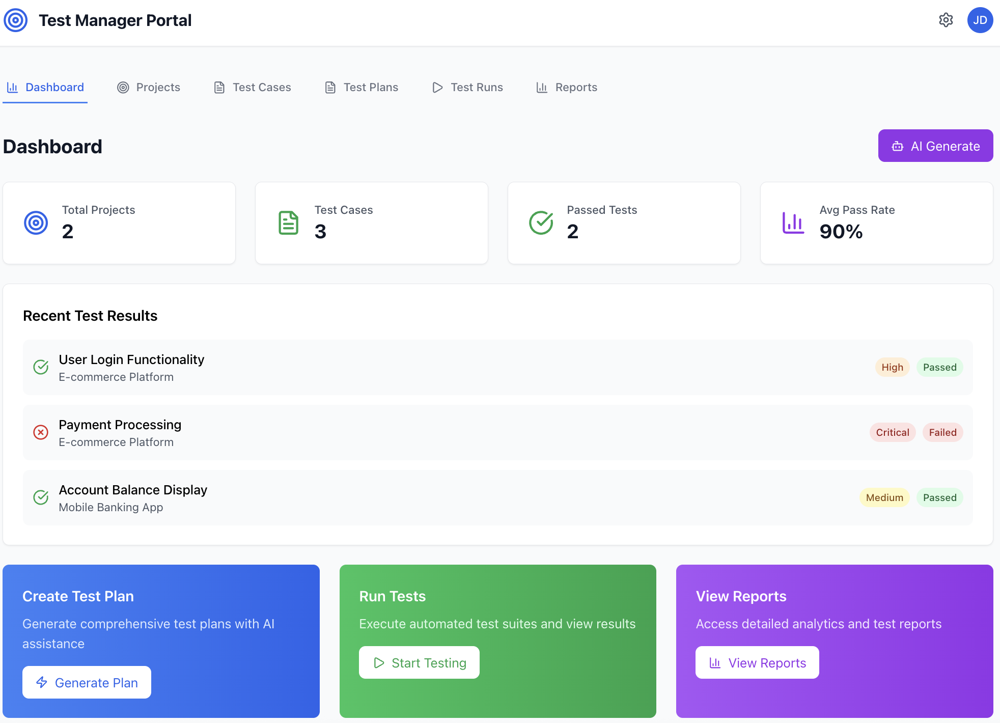

# Test Manager Portal

A comprehensive test management application built with React that provides AI-powered test case generation, project management, test planning, and execution tracking.

## Features

- **Dashboard**: Overview of testing metrics and recent test results
- **Project Management**: Create and manage testing projects
- **Test Case Management**: Design, organize, and execute test cases
- **Test Planning**: Strategic test planning with comprehensive documentation
- **Test Execution**: Track test runs and analyze results
- **AI Generation**: AI-powered generation of projects, test cases, test plans, and test runs
- **Reporting & Analytics**: Comprehensive reports and performance metrics

## Screenshots

### Dashboard Overview

*Main dashboard showing testing metrics, project overview, and recent test results*

### Projects Management

*Project management interface with project cards showing test metrics and team information*

### Test Cases

*Test case management with filtering, status tracking, and execution controls*

### Test Plans

*Strategic test planning interface with test case selection and strategy documentation*

### Test Runs

*Test execution tracking with progress monitoring and results analysis*

### Reports & Analytics

*Comprehensive reporting dashboard with execution summaries and performance metrics*

### AI Generation

*AI-powered generation modal for creating projects, test cases, plans, and runs*

### Project Creation Modal

*Modal interface for creating and editing projects*

### Test Case Creation Modal

*Modal interface for creating and editing test cases*

### Test Plan Creation Modal

*Comprehensive test plan creation with strategy documentation*

### Test Run Creation Modal

*Test run configuration and execution setup*

## Getting Started

### Prerequisites
- Node.js (v16 or higher)
- npm or yarn

### Installation

1. Clone the repository:
```bash
git clone <repository-url>
cd testara
```

2. Install dependencies:
```bash
npm install
```

3. Start the development server:
```bash
npm start
```

4. Open [http://localhost:3000](http://localhost:3000) to view it in the browser.

## Usage

### Creating a Project
1. Navigate to the Projects tab
2. Click "New Project" or use "AI Generate" for AI-powered creation
3. Fill in project details including name, description, and team members
4. Save to create the project

### Managing Test Cases
1. Go to the Test Cases tab
2. Create new test cases manually or use AI generation
3. Assign test cases to projects and set priorities
4. Execute tests directly from the interface

### Planning Tests
1. Access the Test Plans tab
2. Create comprehensive test plans with strategy documentation
3. Select relevant test cases for inclusion
4. Define testing objectives, scope, and approach

### Executing Tests
1. Navigate to Test Runs
2. Create new test runs from test plans or manually
3. Track execution progress and results
4. Analyze pass/fail rates and performance metrics

### Viewing Reports
1. Go to the Reports tab
2. View execution summaries and analytics
3. Export reports for external sharing
4. Analyze project performance trends

## Technology Stack

- **Frontend**: React, Tailwind CSS
- **Icons**: Lucide React
- **State Management**: React Hooks (useState)
- **Styling**: Tailwind CSS utility classes

## Key Components

- **Dashboard**: Metrics overview and recent activity
- **Project Cards**: Visual project representation with statistics
- **Test Case Table**: Tabular view with filtering and actions
- **Test Plan Cards**: Strategic planning interface
- **Test Run Tracking**: Execution progress and results
- **AI Generation Modal**: AI-powered content creation
- **Form Modals**: Create/edit interfaces for all entities

## Contributing

1. Fork the repository
2. Create a feature branch (`git checkout -b feature/amazing-feature`)
3. Commit your changes (`git commit -m 'Add some amazing feature'`)
4. Push to the branch (`git push origin feature/amazing-feature`)
5. Open a Pull Request

## License

This project is licensed under the MIT License - see the [LICENSE](LICENSE) file for details.

## Screenshots Instructions

To capture screenshots for this README:

1. **Start the application**: Run `npm start` and navigate to `http://localhost:3000`

2. **Capture the following views**:
   - Dashboard: Main page with metrics and overview
   - Projects: Projects tab showing project cards
   - Test Cases: Test cases tab with table view
   - Test Plans: Test plans tab with plan cards
   - Test Runs: Test runs tab with execution tracking
   - Reports: Reports tab with analytics
   - AI Generation: Click any "AI Generate" button to show modal
   - Modals: Open each creation modal (Project, Test Case, Test Plan, Test Run)

3. **Screenshot specifications**:
   - Resolution: 1920x1080 or similar
   - Format: PNG
   - Include browser chrome if desired
   - Ensure UI is in a clean state with sample data visible

4. **Save screenshots** in the `screenshots/` folder with the following names:
   - `dashboard.png`
   - `projects.png`
   - `test-cases.png`
   - `test-plans.png`
   - `test-runs.png`
   - `reports.png`
   - `ai-generation.png`
   - `project-modal.png`
   - `test-case-modal.png`
   - `test-plan-modal.png`
   - `test-run-modal.png`

## Future Enhancements

- Integration with external testing tools
- Advanced reporting and analytics
- Team collaboration features
- API integrations
- Mobile responsive design improvements
- Real-time notifications
- Advanced AI capabilities
